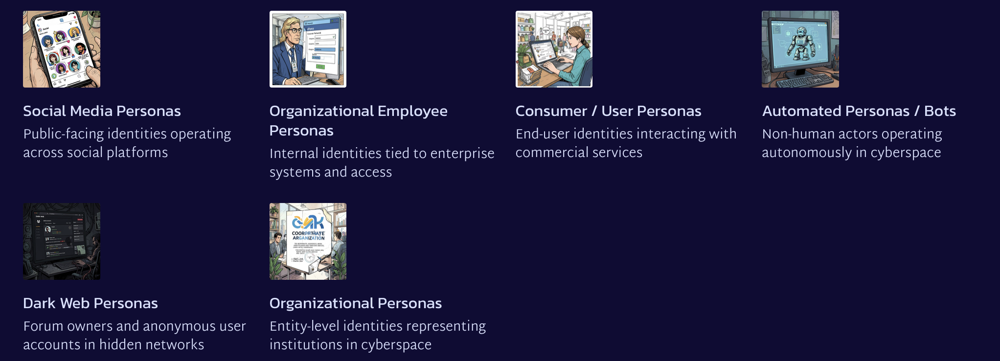
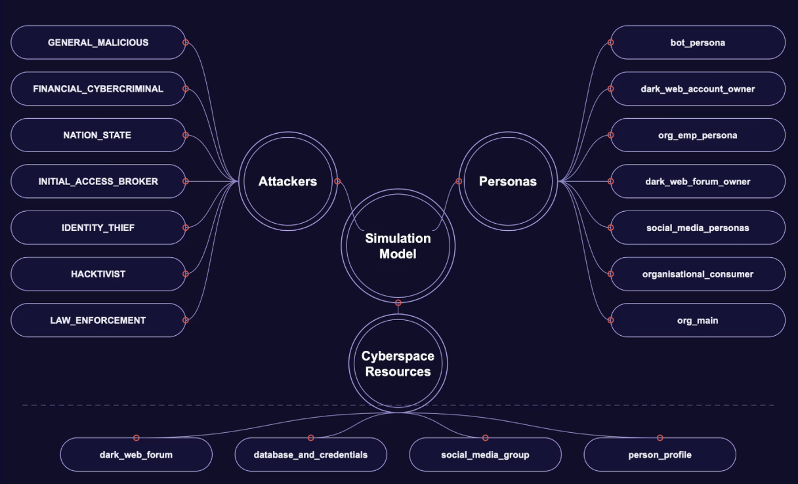
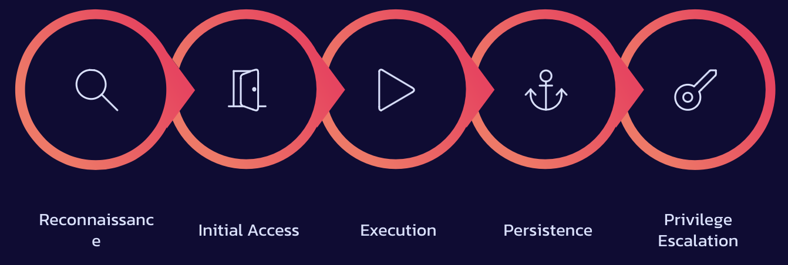
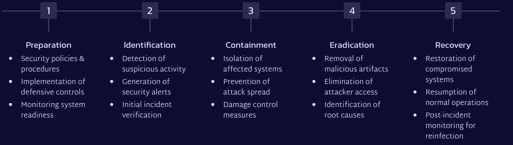

# Cyberspace_simulation

## Reswarch gap identified

Identified gaps between JP 3-12 military doctrine and Industry standards such as NIST and SANS.
It was found that military doctrine (JP 3-12) includes concepts that are largely absent from industry frameworks such as:

- Cyber Persona Layer — structured identity modeling in cyberspace
- Synchronization of Cyber Operations — coordinated multi-domain timing

**Cyber persona layer**
JP 3-12 explicitly models actors and identities in cyberspace as a distinct operational layer — the Cyber Persona Layer — recognizing that identity is a core element of cyber operations.
Industry standards focus on assets, networks, incidents, and systems. Do not provide a structured cyber persona model — identity is treated implicitly, not as a first-class operational concept.

**Research Question**: How should cyber personas be represented and modeled in a way that supports both military doctrine and broader cybersecurity practice?

## Cyber persona research

## Structure of simulation

## Attacker modelling

### Attacker type:

| Attacker                | Allowed attacks                                       |
| ----------------------- | ----------------------------------------------------- |
| General malicious       | Get access, Get credentials                           |
| Financial cybercriminal | Get credentials, Get access                           |
| Initial access broker   | Get access                                            |
| Identity thief          | Get credentials                                       |
| Hacktivist              | Get access                                            |
| Law enforcement         | Turn platform into honeypot, Collect data and observe |
| Nation state            | Get access, Collect data and observe, Get credentials |

### Attack framework

Attacker behavior within the simulation is engineered using core concepts from established cybersecurity frameworks, providing a robust foundation for realism and operational relevance.

- MITRE ATT&CK Framework
- Cyber Kill Chain
- Threat actor tactics from existing cybersecurity literature

## Persona modelling

### OCEAN personality traits

Each cyber persona is assigned personality traits using the OCEAN (Big Five) personality model.
Trait values sampled from Gaussian (Normal) distributions.
Mean and standard deviation selected to represent realistic human variation.
Allows different behavioral tendencies among personas.
Personality influences decision-making, interactions, and susceptibility to cyber attacks.

Traits include:

=> Openness
=> Conscientiousness
=> Extraversion
=> Agreeableness
=> Neuroticism

## Incident response model

#### Incident Response Lifecycle

Our simulation incorporates an organizational response based on the SANS Incident Handling Process, a widely recognized framework for managing cybersecurity incidents effectively.

